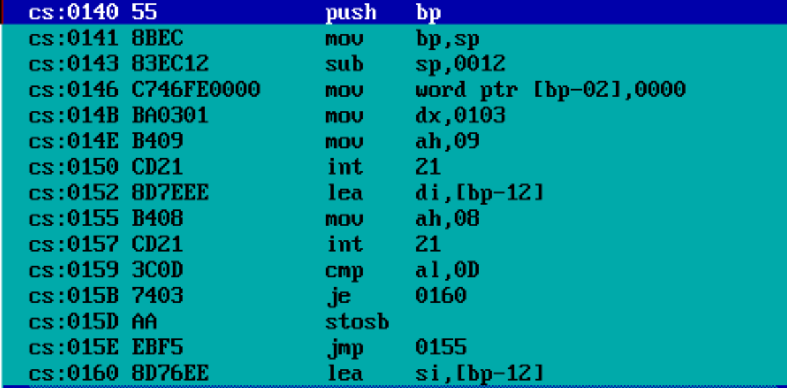
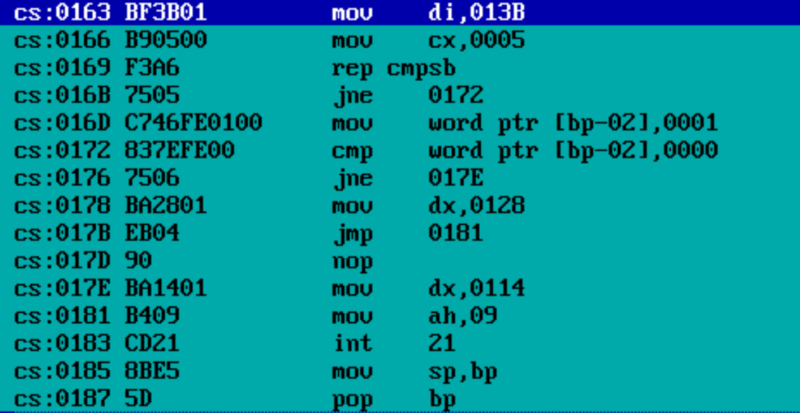

# CRACKME

## Main goal

We have the `.com` binary file of the program (we does not have `.asm` file) that asks for a password and prints `Access denied` or `Access granted`, depends on what you entered. 

Using the buffer-overflow we need to `crack` the program making it print `Access granted`.

## Cracking

Lets check the disasm important parts:

As we can see on first picture, programmer left `12h` bytes in stack buffer for the password (and maybe something more) - `line 3`.

We want to have not `0` in `[bp-02]` to get `Access granted` - pic 2 `line 6`.

`12h` is `18d`, we want not `0` in `[bp-02]` so it is obvious we just need to enter `17` `symbols` to crack the program.
 